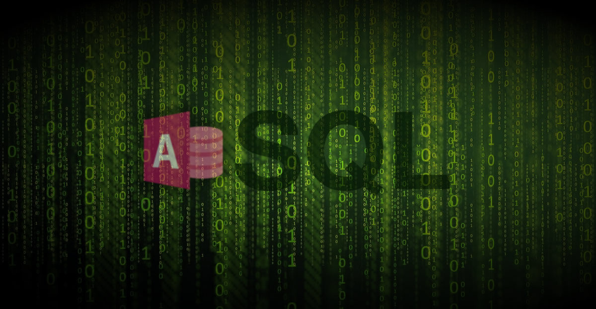
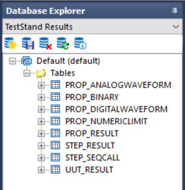

# Goal
Create a tool to extract and decompose test data from the default TestStand database schema into flat CSV files.

# Background
TestStand has a native database logger that stores test runs in a local database using the default TestStand schema pictured below.

The benefit of this default schema is it allows for a one-click data recording solution that records *all* test data and limits. It also has the flexibility to change with the test as new steps and limits are added or existing steps and limits changed without changing the schema or losing test history. However, extracting the data for production analysis is more cumbersome than just exporting some tables. There are several interrelated tables that have to be deconvoluted and joined in specific ways to construct a dataframe that can be used by test and manufacturing engineers to see trends in test data for each measurement across different UUT runs.

The UUT_RESULT table will store the results of an individual UUT. The STEP_RESULT table will store the results of each step executed in the test. Notice that the UUT column is a foreign key that is tied to the UUT_RESULT table. The MEAS_NUMERICLIMIT table will store the results of each step. Notice that the STEP column refers to the STEP_RESULT table. Other tables are interrelated depending on the particular configuration of the test sequence and measurements. The full relational details can be found at this [LINK](https://www.ni.com/en/support/documentation/supplemental/07/creating-a-teststand-database-schema-from-scratch.html#section-177045979).

This makes data monitoring and trend analyis very difficult for most test and MFG groups, and this is what motivated the project.

# Methodology
We constructed a SQL script to extract the appropriate columns from the UUT_RESULT, STEP_RESULT, PROP_RESULT, and PROP_NUMERICLIMIT using combinations of LEFT JOINS and UUT_ID matchings. However, this returns all data collections irrespective of sequence name. This is not useful to production engineers because all the different processes are conflated into a single file. For that reason, we had to add an additional SQL script to filter each file into specific sequence names using unique entries in the STEP_SEQCALL table.

At this point, the SQL scripts had become unwieldly and user-UNfriendly, so we encapsulated these core functionalities in a python script to make the process as turn-key and painfree as possible.

For the first iteration, we created a Jupyter Notebook to select the local .mdb file and execute the SQL queries in proper order. Then we added python functions to transform the various tables into a single Test Results Data Table according to the Sequence Name. Finally we export each output table to a CSV file and name it with the Sequence Name. 

With this successful proof-of-concept, our next iteration was to refactor the Jupyter Notebook into "proper" python code, with clearly delimited function definitions. We named this *main.py* and tested it as a stand-alone, single-file implementation of the python script. It uses NO modules; everything is in this single script file.

After that, we wanted to package our project in a proper manner, so we refactored the *main.py* script into individual modules and sub-modules. *ts_db.py* represents the modular, parameterized, multi-file implementation of the python script. Uses custom file_io and database modules. Called by the *app.py* script. *app.py* is the top-level web application implementation of the python script. Uses custom *file_io* and *database* modules. Calls the submodule *ts_db.py* script.

Our final step was to host the web app on the net. We tried Railway.com, Render.com, and Streamlit.com. However, the web application approach proved unfeasible because hosted web apps cannot have access to local ODBC, which is a requirement for pyodbc to function properly. 

# Results
In the end, we went back to our single-file implementation (main.py) and used *auto-py-to-exe* to build a stand-alone executable file that users could download to the test stand machine and run to decompose the .mdb file into its constituent CSV data logs. This executable worked perfectly on different machines, transforming TestStand Database files into their component CSV data logs.

# Dependencies
NOTE: Python packages should be installed with `poetry install` command for current pyproject.toml

[tool.poetry.dependencies]

python = "^3.10"

pyodbc = "^4.0.35"

pandas = "^2.0.0"
